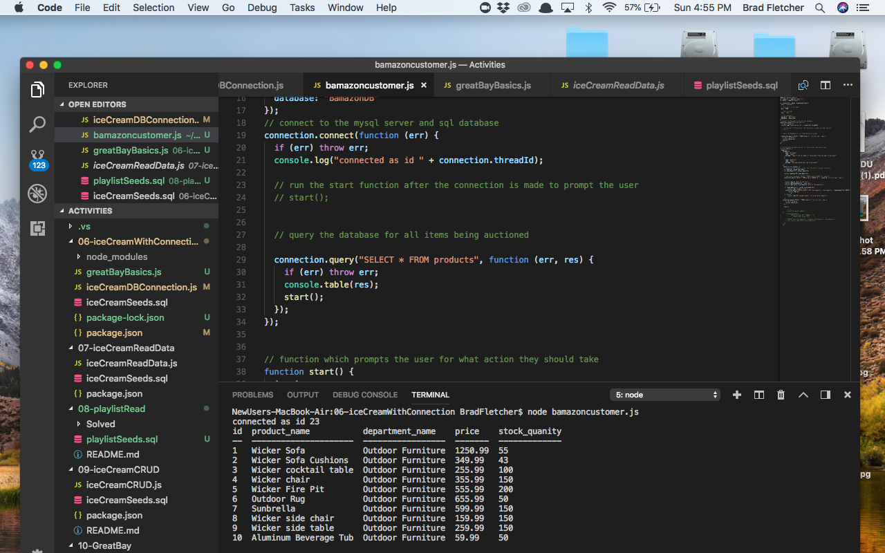
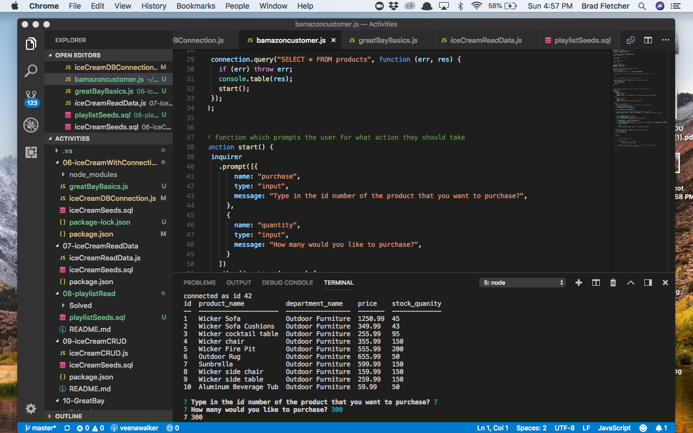
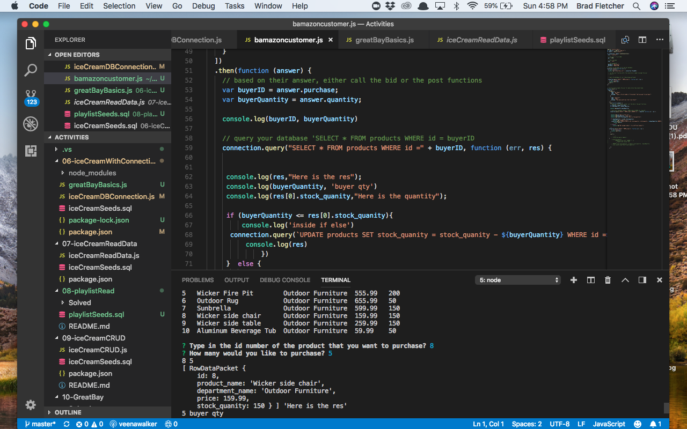
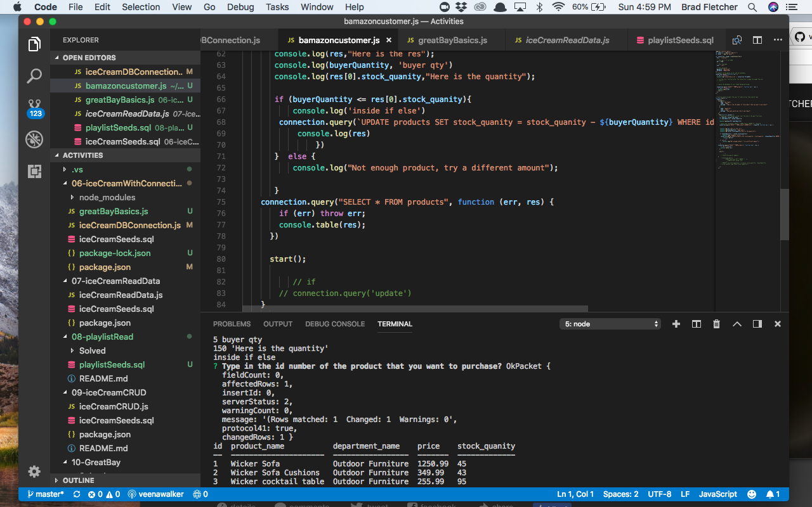
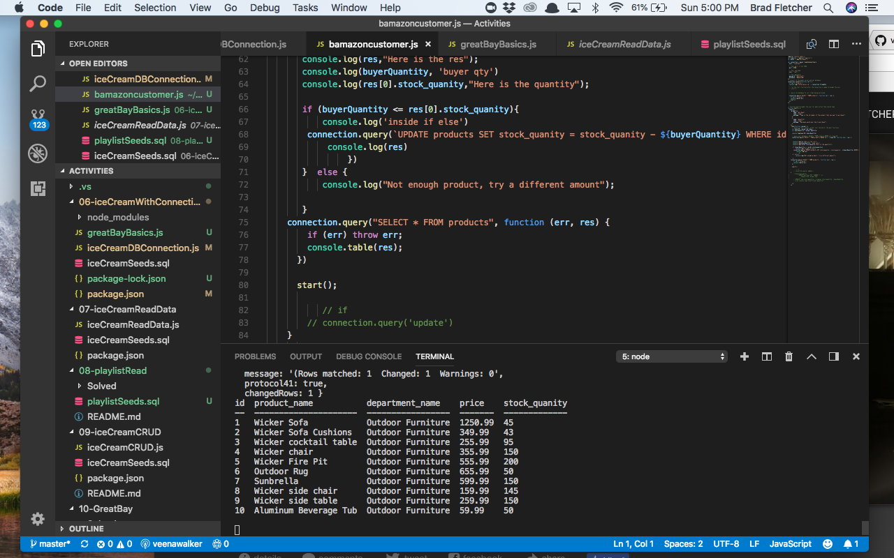
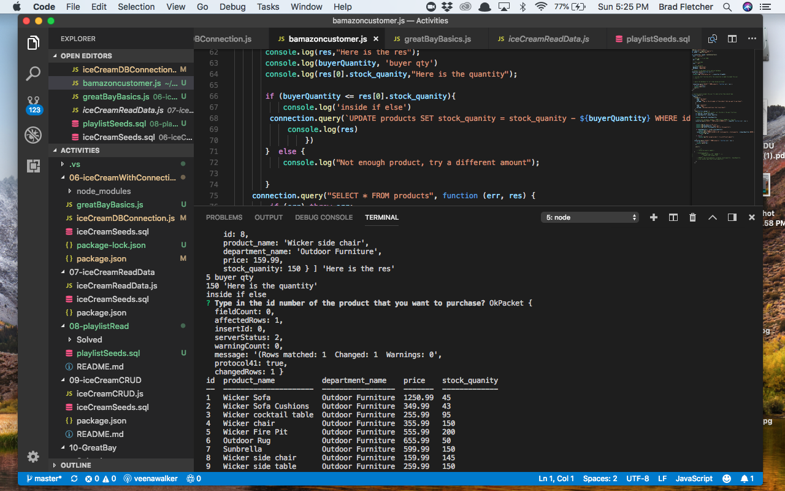

# Bamazon
1. For this activity I created a **MYSQL database** called Bamazon which included a table called products and had columns for the:
* item id 
* product name 
* department name 
* price  
* stock quantity 

2. The products that I included were *outdoor furniture*.

3. Once I ran Node it console logged the table with all of the products. 
4. The app then prompted the user to select the product and quanity.
5. Once the user selected the product and quantity first it checked to see if there was enough to fulfill the order and if yes it deducted it from the quantity. 
6. If the quantity was too high the user was promted to select the product and quantity at a lower amount. 

